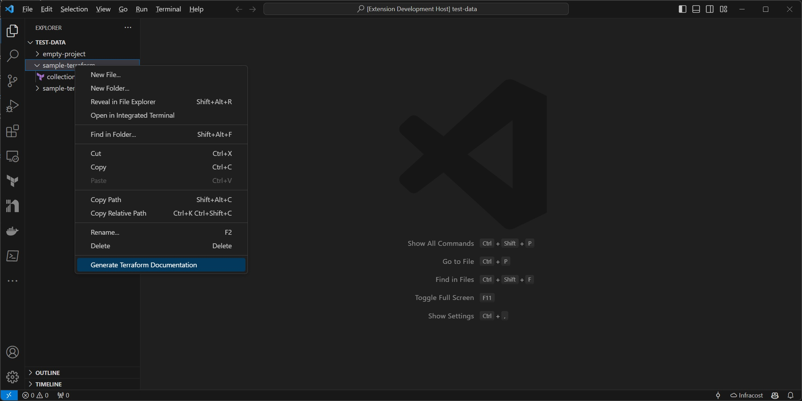

# Terraform-Docs Visual Studio Code Extension

This visual studio code extension uses [Terraform-Docs](https://github.com/terraform-docs/terraform-docs) to generate documentation for Terraform projects.

Please report any issues using this pluginn [here](https://github.com/Derek-Ashmore/terraform-docs-vscode/issues).

## Table of Contents
<!-- TOC depthFrom:2 depthTo:2 updateOnSave:false -->

- [Features](#features)
- [Requirements](#requirements)
- [Product Roadmap](#product-roadmap)

## Features

> This product will generate Terraform project documentation within Visual Studio Code

To generate documentation for a Terraform project, right-click on the folder containing Terraform code.



> ```.terraform-docs.yml``` configurations are honored.

If you provide a ```.terraform-docs.yml``` configuration file for terraform-docs (to control formatting and output), it will be used in the generation. It must be in located in the folder containing Terraform code to be documented.

If you do not provide a terraform-docs configuration file, markdown will be generated and the output file will be named ```README.md```.

## System Requirements

> Terraform-Docs must be installed.

Installation instructions are [here](https://github.com/terraform-docs/terraform-docs#installation)

## Product Roadmap

* Provide settings for:
    * terraform-docs configuration location